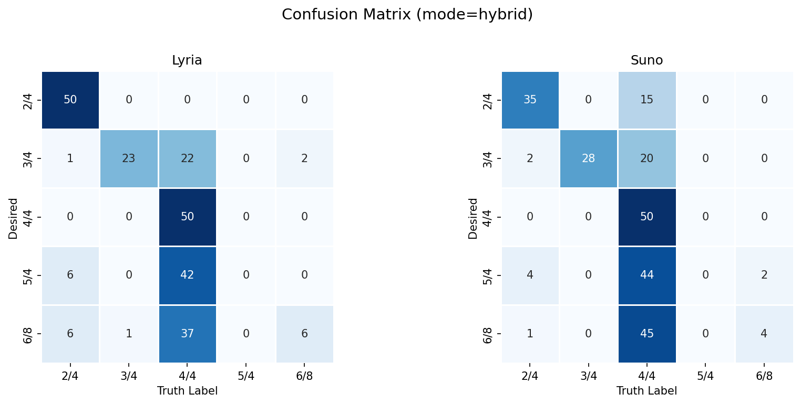
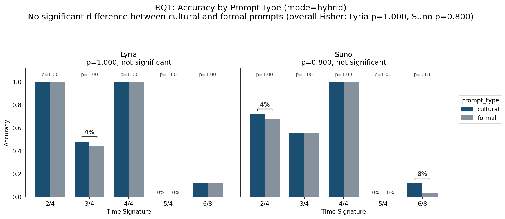
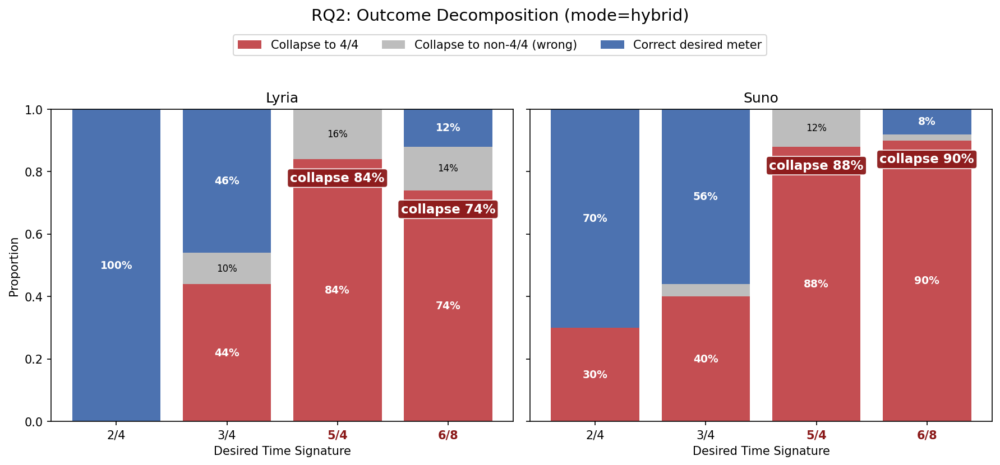
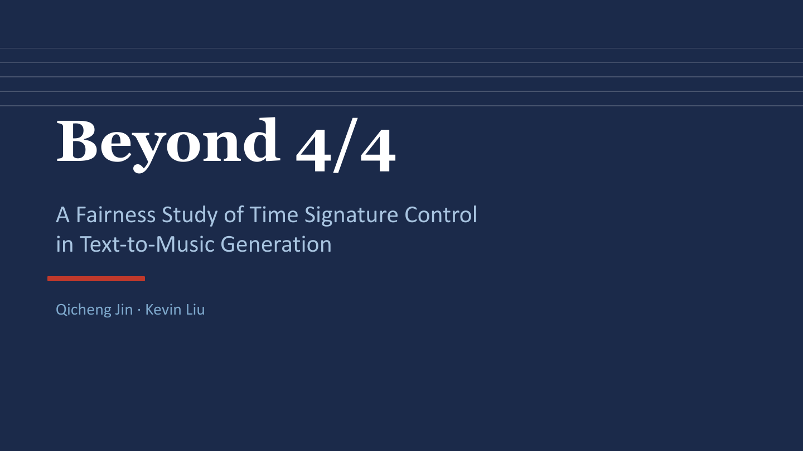

# Beyond 4/4

### A Fairness Study of Time Signature Control in Text-to-Music Generation

**Qicheng Jin · Kevin Liu** 
University of Chicago · DATA 359 · May 2026

[Read the report source](_DATA359__final_project/main.tex) · [View the presentation](beyond_4_4_presentation.pdf) · [Explore the analysis](analysis.ipynb)

## Overview

This project studies fairness in text-to-music generation through the lens of
**time-signature control**. We evaluate whether two leading music-generation
models can follow rhythmic constraints beyond the dominant 4/4 meter, and
whether the way a user phrases a request changes the outcome.

Our results show that prompt phrasing is not the main source of disparity.
Instead, both models systematically struggle with less common meters -
especially 5/4 and 6/8 - and frequently collapse those requests into 4/4.

> **Key finding:** 5/4 and 6/8 requests collapse to 4/4 at rates between
> **74% and 90%**, while both models achieve **100% accuracy on 4/4**.

## Why time signatures matter

A time signature describes how beats are grouped into a repeating cycle. In
4/4, listeners count four beats per bar; a waltz uses three beats in 3/4; the
*Mission: Impossible* theme is a familiar example of 5/4.

Rhythm is a core constraint in composition, film scoring, game audio, dance,
and culturally specific musical traditions. When a model defaults to 4/4, it
does more than miss a technical instruction: it provides worse service for
users working with traditions and styles built around other meters.

We investigate two questions:

1. **User-experience bias:** Do models respond differently when the same meter
   is requested through a cultural description (such as “a waltz”) versus a
   formal music-theory instruction (such as “in 3/4 time”)?
2. **Cultural bias:** Do models systematically convert less common meters into
   4/4, under-representing musical traditions that rely on other rhythmic
   structures?

## Methodology

### Models

- **Suno v4.5**
- **Lyria 3 (Google)**

### Experimental design

We evaluate five target meters: **2/4, 3/4, 4/4, 5/4, and 6/8**. For every
meter, we create five matched prompt pairs:

| Prompt style | Example |
|---|---|
| Cultural | “A dramatic waltz with full orchestra and sweeping strings.” |
| Formal | “A dramatic piece in 3/4 time with full orchestra and sweeping strings.” |

Each pair keeps instrumentation, mood, and style similar while changing how the
meter is communicated. The experiment contains **250 generated songs per
model**, for **500 generations in total**.

### Hybrid labeling

We use `madmom`, a music-information-retrieval library, for automatic beat,
downbeat, and meter analysis. Samples with confidence below 0.9 are manually
reviewed. This hybrid pipeline combines scalable automatic labeling with human
verification for ambiguous outputs.

## Results

### Overall behavior

Both models perform best on common meters. Lyria reaches 100% accuracy on 2/4
and 4/4, while Suno reaches 70% on 2/4 and 100% on 4/4. Performance drops
sharply on 3/4 and 6/8; neither model successfully produces 5/4 in this study.

### RQ1: Prompt type does not significantly change accuracy

We observe small gaps between cultural and formal prompts for a few meters:
4 percentage points for Lyria on 3/4, 4 points for Suno on 2/4, and 8 points for
Suno on 6/8. Fisher's exact tests find no statistically significant difference
for either model overall (**Lyria p = 1.000; Suno p = 0.800**).

**Conclusion:** the data does not support the user-experience-bias hypothesis.
Both models handle cultural and formal phrasings similarly.

### RQ2: Less common meters collapse into 4/4

The dominant failure pattern is not random: requested non-4/4 meters are often
returned as 4/4.

| Desired meter | Lyria → 4/4 | Suno → 4/4 |
|---|---:|---:|
| 2/4 | 0% | 30% |
| 3/4 | 44% | 40% |
| 5/4 | **84%** | **88%** |
| 6/8 | **74%** | **90%** |

The pattern is strongest for 5/4 and 6/8, where collapse dominates correct
generation. These findings support the cultural-bias concern: less common time
signatures are systematically under-produced.

## Fairness implications

When models default to 4/4, traditions built around other meters receive less
reliable support. Examples include 5/4 jazz, 6/8 Irish jigs, 7/8 Balkan music,
9/8 slip jigs, and polyrhythmic West African styles.

This also creates practical inequality at the user level. Musicians and
producers who require a specific meter face additional prompting, regeneration,
and editing work, while users requesting mainstream 4/4 styles are consistently
better served.

## Limitations

- The study evaluates 250 generations per model; some observed differences may
  require a larger sample to reach statistical significance.
- Only Suno v4.5 and Lyria 3 are evaluated, so the findings may not generalize
  to every text-to-music system.
- The prompt set covers five meters and a limited set of traditions. It does not
  test other important rhythmic systems or songs that change meter over time.

## Conclusion

Current text-to-music systems provide uneven rhythmic coverage. We find no
significant difference between cultural and formal prompt phrasing, but strong
evidence that uncommon meters - particularly 5/4 and 6/8 - collapse into 4/4.
Improving meter control is therefore important not only for generation quality,
but also for fair representation across musical traditions.

## Project presentation

Click the cover below to open the complete PDF presentation.

